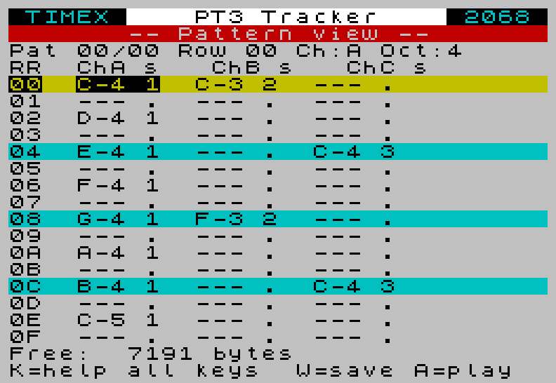
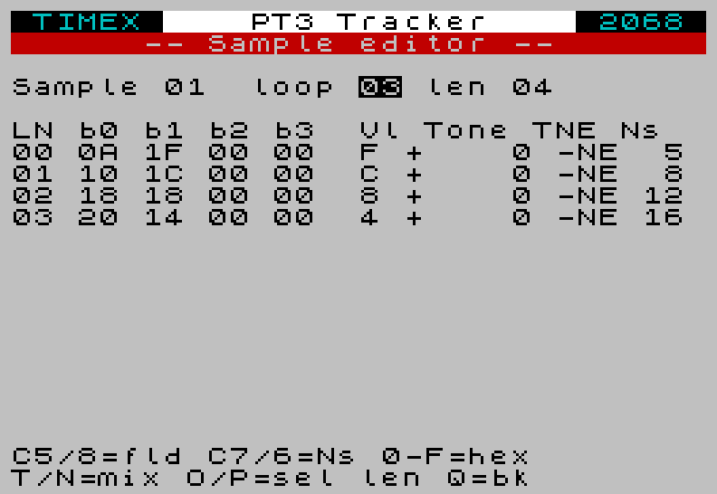
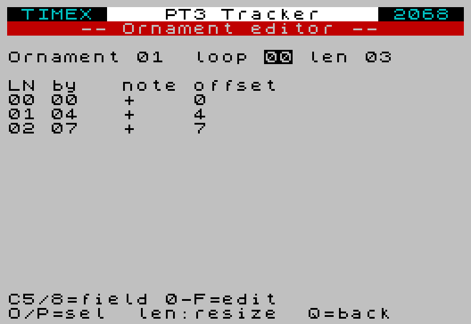
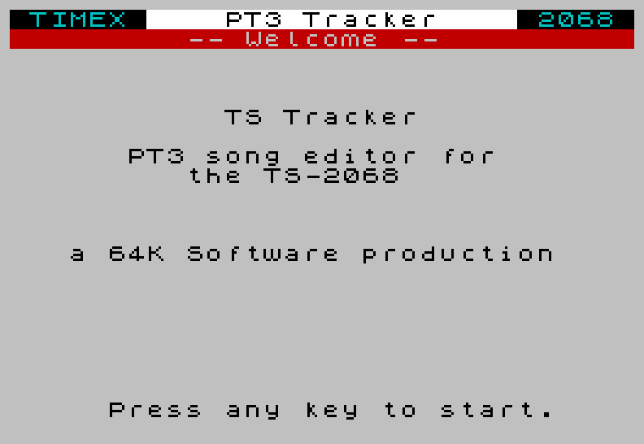

# TS Tracker — PT2 / PT3 player + editor for the Timex/Sinclair 2068

Two companion apps for the **Timex/Sinclair 2068**:

- **`pt3-player`** — a standalone music player that reads **ProTracker 2
  (`.pt2`) and Vortex Tracker II / ProTracker 3 (`.pt3`)** songs straight off
  cassette and plays them through the AY-3-8912.
- **`tracker`** — a full on-machine pattern editor: load a PT3 to rework or
  start one from scratch, edit notes/volumes/rests across the three channels,
  design instruments (the sample and ornament editors), and save back to tape.
  See the user manual: [docs/manual.md](docs/manual.md) (with a printable
  dot-matrix [PDF](docs/manual.pdf)).

Built with [z88dk](https://github.com/z88dk/z88dk) (SDCC backend) for the
C side, and [sjasmplus](https://github.com/z00m128/sjasmplus) for the asm
PT2/PT3 driver. Output is a single Spectrum-format `.tap` that loads on
**any** emulator (zesarux, FUSE, ...) and on real hardware via the
**TS-PICO** in tape-emulation mode.

## The editor

Compose three-voice AY chip-tunes right on the 2068. See the user manual
([docs/manual.md](docs/manual.md), printable [PDF](docs/manual.pdf)) for the
full guide and a step-by-step "your first tune" walkthrough.

| Pattern editor | Sample editor |
| --- | --- |
|  |  |
| Three voices, beat-line colouring, live free-RAM counter. | Shape a volume envelope and sweep the noise pitch. |
| **Ornament editor** | **Title screen** |
|  |  |
| Build the classic arpeggio "chords" (here `0 +4 +7`). | Boots straight to a Sinclair-style menu. |

## What it does

- Boots to a Sinclair-style menu (TIMEX banner, status line, INVERSE-key
  hotkeys) and waits for you to insert a tape.
- **Scans** the tape: reads every header, lists each CODE block in a
  9-entry directory, auto-detects PT2 vs PT3 from the file's data magic.
- **Plays** any song on demand by index (1-9), or **plays all songs**
  in order, or **rescans** a fresh tape.
- Live coloured volume bars for the three AY channels while a song plays.
- Per-channel **mute** while playing (keys 1/2/3 toggle channels A/B/C).
- **Photosensitivity-safe**: no flashing border, the bars only redraw
  cells that change, no high-contrast strobing anywhere.

Tape compatibility:

| Source                          | Works | Notes |
| ------------------------------- | :---: | ----- |
| `.tap` of CODE blocks in emulator |  ✓  | Both auto-looping and one-shot tape feed |
| Real cassette on a TS2068        |  ✓  | Press CAPS+SPACE when the tape ends |
| TS-PICO SD card (tape mode)      |  ✓  | Mount the same `.tap`; works the same |

## Quick start

If you just want to try it without setting up the toolchain, download the
latest **`ts-tracker.zip`** from the
[**Releases page**](https://github.com/factus10/TS-Tracker/releases/latest).
It contains both apps (`tracker.tap` and `pt3-player.tap`), the sample songs
(`songs.tap`), and the manual PDF. (The same prebuilt files are also kept in
[`release/`](release/) in the repo.)

To build from source, you need `z88dk` and `sjasmplus` on `PATH`. The
Makefile exports `Z88DK_HOME` and `ZCCCFG` itself, so a fresh shell
works.

```sh
make tracker           # build/tracker.tap     (the editor)
make pt3-player        # build/pt3-player.tap  (the player)
make songs-tape        # build/songs.tap       (every song in songs/, one per CODE block)
make release           # release/ts-tracker.zip (all of the above + the manual)
```

Drop your own `.pt2` / `.pt3` files in `songs/` first and re-run
`make songs-tape` to rebuild the song tape.

To try it in zesarux:

```sh
zesarux --machine ts2068 --tape build/pt3-player.tap
# After the player boots, swap tapes (zesarux: F5 -> Insert tape ->
# build/songs.tap), press S to scan, then 1-9 to play.
```

## Using the player

| Boot screen | Directory after a scan |
| --- | --- |
|  |  |

**On the empty / "no tape" screen:**

| Key | Action |
| --- | --- |
| `S` or SPACE | Scan the tape — read every header, build the directory |
| `Q` or ENTER | Quit to BASIC |

**During a scan:** the player reads each tape block in turn and prints
the song name as it's found. Standard Spectrum tape-load border flash
gives you progress.

| Key | Action |
| --- | --- |
| CAPS+SPACE | Stop scanning. Use this when the tape ends on real hardware (the player can't tell the tape is finished otherwise). |

The scanner also stops automatically if it sees a duplicate filename
(common in emulators that auto-loop the `.tap`).

**On the directory screen** (after a successful scan):

| Key | Action |
| --- | --- |
| `1`-`9` | Play that song (rewind tape first!) |
| `A` | Play all songs in order |
| `R` | Rescan the tape |
| `Q` or ENTER | Quit to BASIC |

Because cassettes are sequential, **you have to rewind the tape (or
restart the `.tap` in your emulator) before each play**. The player
reads forward from wherever the tape is until it reaches the song you
asked for.

**While a song is playing:**

| Key | Action |
| --- | --- |
| `1` / `2` / `3` | Toggle mute on channel A / B / C |
| SPACE | Stop and return to the directory |
| CAPS+SPACE | Stop "play all" and return to the directory |

Channel mute persists across songs in the same session.

## Status

- [x] PT3 playback through the AY-3-8912 on the TS2068
- [x] PT2 playback (Bulba's PTxPlay handles both formats)
- [x] Live coloured volume bars (diff-redraw, no flicker, no playback drag)
- [x] Tape directory scan with duplicate-detection
- [x] Selective play, play-all, rescan
- [x] Channel mute
- [x] **Tracker app** — decoded-model pattern editor: note/volume/rest entry,
      beat-lined grid, in-editor playback, per-cell sample + ornament, full
      sample and ornament editors, and save-back to tape. See `docs/manual.md`
      and `docs/architecture.md`.
- [x] **Sound editor (v1.2)** — per-line noise pitch + envelope display, master
      noise-pitch authoring, song tempo/speed editing, cursor-key field nav, and
      a memory-map reclaim that grew the song slot ~5.6 KB → ~7.4 KB.
- [ ] TS-PICO native file loading (load any `.pt3` by filename via TPI)
- [ ] Live playback while editing; hardware-envelope authoring; multi-pattern
      real-song verification on hardware (see `TODO.md`)

## Build details

We target `+zx` (not `+ts2068`): z88dk's TS2068 clibs are sccz80-only,
but the upstream PT3 player needs SDCC. The TS2068 happily loads
Spectrum-flavoured `.tap`s, and our AY backend talks directly to the
TS2068's `$F5` / `$F6` ports so the `+zx` clib's Spectrum-128 AY
assumptions never come into play.

Each tape is C code at `$8000`, then PTxPlay and a tape song slot above it.
**The two apps have decoupled memory maps.** A memory-map optimisation on the
tracker (dropping the unused crt0 stdio/heap code — it prints via a raw `RST $10`
thunk — and slimming its PTxPlay copy to PT3-only) freed enough RAM that, even
with the extra editor code, the tracker now carries a comfortable song slot.
The player keeps its original layout:

| App | C code | PTxPlay | Song slot | Notes |
| --- | --- | --- | --- | --- |
| player  | `$8000` | `$D700` | `$E200` (~6.4 KB) | small binary, full slot |
| tracker | `$8000` | `$D500` | `$DE00` (~7.4 KB) | CRT-diet build; + decoded song model at `$6000` |

`PLAYER_PTX_ORIGIN_HEX`/`PLAYER_SONG_BASE_HEX` and `PTX_ORIGIN_HEX`/
`TAPE_SONG_BASE_HEX` (the tracker's) in the Makefile are the single source of
truth. Each app builds its own PTxPlay at its own origin (the player's into
`build/player/`); the origin goes to `tools/build_ptxplay_asm.py` and the song
base to the C compiler as a per-app `-D`. PTxPlay's symbol addresses are pulled
into a generated `ptxplay_addrs.h` per origin, so the C side never hardcodes
them. If a C binary outgrows its PTX origin, the
`tracker.tap` / `pt3-player.tap` rules abort with an explicit error
message telling you to bump the constant.

## Credits

The driver core is **Vortex Tracker II PT3 player** by **Sergey Bulba**,
which has been carried across the ZX/MSX scene by:

- **S.V. Bulba** — original ZX Spectrum player ([https://bulba.untergrund.net](https://bulba.untergrund.net), now defunct)
- **Dioniso** — MSX adaptation (2005)
- **msxKun** — MSX ROM arrangements
- **SapphiRe** — asMSX version with split PLAY / PSG write
- **mvac7** — SDCC C wrapper

For this project we use Bulba's combined `PTxPlay.asm` (universal PT1 /
PT2 / PT3 driver), assembled with sjasmplus and called from C through
small thunks. The header-reading flow on the C side is inspired by
**Header5.tap** (T-S Horizons / T/S User Group / Bill Ferrebee, 1984).

Upstream:

- [github.com/mvac7/SDCC_PT3player_Lib](https://github.com/mvac7/SDCC_PT3player_Lib)
- [github.com/mvac7/SDCC_AY38910BF_Lib](https://github.com/mvac7/SDCC_AY38910BF_Lib)
- [github.com/electrified/rc2014-ym2149](https://github.com/electrified/rc2014-ym2149) (where we found PTxPlay.asm)

## Layout

```
src/
  ay_ts2068.[ch]          AY-3-8912 backend (TS2068 ports $F5/$F6)
  pt3_player.c            picker UI, scan, directory, play loop, viz
  tracker.c               pattern editor: decoded model, grid, instrument editors
  pt_engine.[ch]          shared PTxPlay wrapper (INIT/PLAY/MUTE thunks, tempo)
  ts_io.[ch]              shared screen + keyboard primitives
  smoketest.c             "does the AY make noise" sanity check (independent)
  pt3_mvp.c, PT3player.*  legacy single-song MVP using mvac7's C-only player
tools/
  build_ptxplay_asm.py    rewrites PTxPlay.asm for our build
  bin_to_c.py             sjasmplus .sym -> ptxplay_addrs.h
  songs_to_tape.py        pack .pt2/.pt3 -> a single .tap of CODE blocks
  append_code_block.py    append a CODE block + LOAD ""CODE to a .tap
  pt3_to_c.py             embed one .pt3 as a C const array (used by pt3-mvp)
vendor/
  PTxPlay/                S.V. Bulba's PTxPlay.asm
  SDCC_PT3player_Lib/     mvac7's SDCC PT3 player (used by pt3-mvp)
  SDCC_AY38910BF_Lib/     mvac7's SDCC AY backend (reference)
songs/                    your .pt3 / .pt2 collection
build/                    generated artifacts (gitignored)
```
