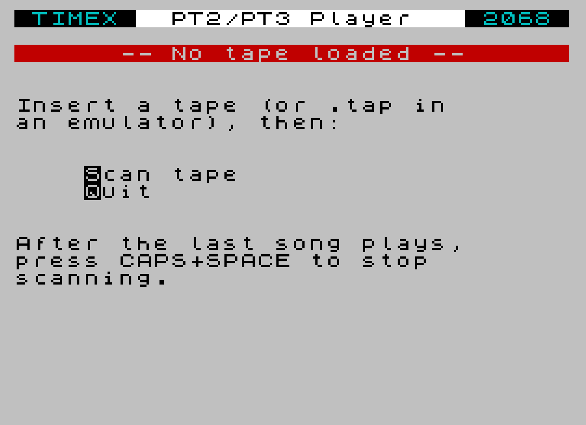
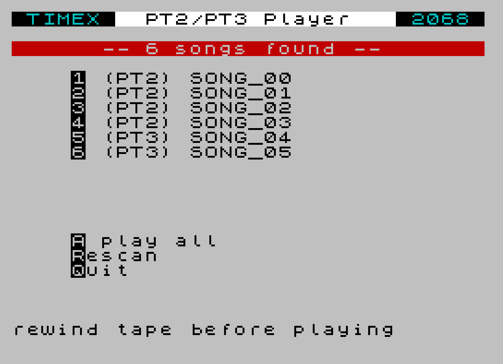

# TS Tracker — PT2 / PT3 player for the Timex/Sinclair 2068

A standalone music player for the **Timex/Sinclair 2068** that reads
**ProTracker 2 (`.pt2`) and Vortex Tracker II / ProTracker 3 (`.pt3`)** songs
straight off cassette and plays them through the AY-3-8912.

Built with [z88dk](https://github.com/z88dk/z88dk) (SDCC backend) for the
C side, and [sjasmplus](https://github.com/z00m128/sjasmplus) for the asm
PT2/PT3 driver. Output is a single Spectrum-format `.tap` that loads on
**any** emulator (zesarux, FUSE, ...) and on real hardware via the
**TS-PICO** in tape-emulation mode.

## What it does

- Boots to a Sinclair-style menu (TIMEX banner, status line, INVERSE-key
  hotkets) and waits for you to insert a tape.
- **Scans** the tape: reads every header, lists each CODE block in a
  9-entry directory, auto-detects PT2 vs PT3 from the file's data magic.
- **Plays** any song on demand by index (1-9), or **plays all songs**
  in order, or **rescans** a fresh tape.
- Live coloured volume bars for the three AY channels while a song plays.
- Per-channel **mute** while playing (keys 1/2/3 toggle channels A/B/C).
- **Photosensitivity-safe**: no flashing border, the bars only redraw
  cells that change, no high-contrast strobing anywhere.

Tape compatibility:

| Source                          | Works | Notes |
| ------------------------------- | :---: | ----- |
| `.tap` of CODE blocks in emulator |  ✓  | Both auto-looping and one-shot tape feed |
| Real cassette on a TS2068        |  ✓  | Press CAPS+SPACE when the tape ends |
| TS-PICO SD card (tape mode)      |  ✓  | Mount the same `.tap`; works the same |

## Quick start

If you just want to try it without setting up the toolchain, grab the
prebuilt tapes from [`release/`](release/) — `pt3-player.tap` (the
player) and `songs.tap` (six bundled chiptunes), or the bundled
[`ts-tracker.zip`](release/ts-tracker.zip) with both plus a quick-start
README.

To build from source, you need `z88dk` and `sjasmplus` on `PATH`. The
Makefile exports `Z88DK_HOME` and `ZCCCFG` itself, so a fresh shell
works.

```sh
make pt3-player        # build/pt3-player.tap  (the player)
make songs-tape        # build/songs.tap       (every song in songs/, one per CODE block)
```

Drop your own `.pt2` / `.pt3` files in `songs/` first and re-run
`make songs-tape` to rebuild the song tape.

To try it in zesarux:

```sh
zesarux --machine ts2068 --tape build/pt3-player.tap
# After the player boots, swap tapes (zesarux: F5 -> Insert tape ->
# build/songs.tap), press S to scan, then 1-9 to play.
```

## Using the player

| Boot screen | Directory after a scan |
| --- | --- |
|  |  |

**On the empty / "no tape" screen:**

| Key | Action |
| --- | --- |
| `S` or SPACE | Scan the tape — read every header, build the directory |
| `Q` or ENTER | Quit to BASIC |

**During a scan:** the player reads each tape block in turn and prints
the song name as it's found. Standard Spectrum tape-load border flash
gives you progress.

| Key | Action |
| --- | --- |
| CAPS+SPACE | Stop scanning. Use this when the tape ends on real hardware (the player can't tell the tape is finished otherwise). |

The scanner also stops automatically if it sees a duplicate filename
(common in emulators that auto-loop the `.tap`).

**On the directory screen** (after a successful scan):

| Key | Action |
| --- | --- |
| `1`-`9` | Play that song (rewind tape first!) |
| `A` | Play all songs in order |
| `R` | Rescan the tape |
| `Q` or ENTER | Quit to BASIC |

Because cassettes are sequential, **you have to rewind the tape (or
restart the `.tap` in your emulator) before each play**. The player
reads forward from wherever the tape is until it reaches the song you
asked for.

**While a song is playing:**

| Key | Action |
| --- | --- |
| `1` / `2` / `3` | Toggle mute on channel A / B / C |
| SPACE | Stop and return to the directory |
| CAPS+SPACE | Stop "play all" and return to the directory |

Channel mute persists across songs in the same session.

## Status

- [x] PT3 playback through the AY-3-8912 on the TS2068
- [x] PT2 playback (Bulba's PTxPlay handles both formats)
- [x] Live coloured volume bars (diff-redraw, no flicker, no playback drag)
- [x] Tape directory scan with duplicate-detection
- [x] Selective play, play-all, rescan
- [x] Channel mute
- [ ] TS-PICO native file loading (load any `.pt3` by filename via TPI)
- [ ] Tracker UI (pattern grid, sample/ornament editors, save)

## Build details

We target `+zx` (not `+ts2068`): z88dk's TS2068 clibs are sccz80-only,
but the upstream PT3 player needs SDCC. The TS2068 happily loads
Spectrum-flavoured `.tap`s, and our AY backend talks directly to the
TS2068's `$F5` / `$F6` ports so the `+zx` clib's Spectrum-128 AY
assumptions never come into play.

Three CODE blocks make up the player tape:

| Block | Address | Bytes | Contents |
| --- | --- | --- | --- |
| 1 | `$8000` | ~7.6 KB | C code: CRT0, AY backend, picker, scan/play logic |
| 2 | `$C000` | 2.6 KB  | PTxPlay (asm-only universal PT2/PT3 driver) |
| — | `$CB00` | up to 13 KB | Tape song slot — the currently loaded song |

PTxPlay is assembled at its final address by sjasmplus from
`vendor/PTxPlay/PTxPlay.asm` (with a TS2068 port-write block spliced
into the AY-output routine). Its symbol addresses are pulled into a
generated `ptxplay_addrs.h` so the C side never hardcodes addresses
that would silently break if the layout shifts.

## Credits

The driver core is **Vortex Tracker II PT3 player** by **Sergey Bulba**,
which has been carried across the ZX/MSX scene by:

- **S.V. Bulba** — original ZX Spectrum player ([https://bulba.untergrund.net](https://bulba.untergrund.net), now defunct)
- **Dioniso** — MSX adaptation (2005)
- **msxKun** — MSX ROM arrangements
- **SapphiRe** — asMSX version with split PLAY / PSG write
- **mvac7** — SDCC C wrapper

For this project we use Bulba's combined `PTxPlay.asm` (universal PT1 /
PT2 / PT3 driver), assembled with sjasmplus and called from C through
small thunks. The header-reading flow on the C side is inspired by
**Header5.tap** (T-S Horizons / T/S User Group / Bill Ferrebee, 1984).

Upstream:

- [github.com/mvac7/SDCC_PT3player_Lib](https://github.com/mvac7/SDCC_PT3player_Lib)
- [github.com/mvac7/SDCC_AY38910BF_Lib](https://github.com/mvac7/SDCC_AY38910BF_Lib)
- [github.com/electrified/rc2014-ym2149](https://github.com/electrified/rc2014-ym2149) (where we found PTxPlay.asm)

## Layout

```
src/
  ay_ts2068.[ch]          AY-3-8912 backend (TS2068 ports $F5/$F6)
  pt3_player.c            picker UI, scan, directory, play loop, viz
  smoketest.c             "does the AY make noise" sanity check (independent)
  pt3_mvp.c, PT3player.*  legacy single-song MVP using mvac7's C-only player
tools/
  build_ptxplay_asm.py    rewrites PTxPlay.asm for our build
  bin_to_c.py             sjasmplus .sym -> ptxplay_addrs.h
  songs_to_tape.py        pack .pt2/.pt3 -> a single .tap of CODE blocks
  append_code_block.py    append a CODE block + LOAD ""CODE to a .tap
  pt3_to_c.py             embed one .pt3 as a C const array (used by pt3-mvp)
vendor/
  PTxPlay/                S.V. Bulba's PTxPlay.asm
  SDCC_PT3player_Lib/     mvac7's SDCC PT3 player (used by pt3-mvp)
  SDCC_AY38910BF_Lib/     mvac7's SDCC AY backend (reference)
songs/                    your .pt3 / .pt2 collection
build/                    generated artifacts (gitignored)
```
