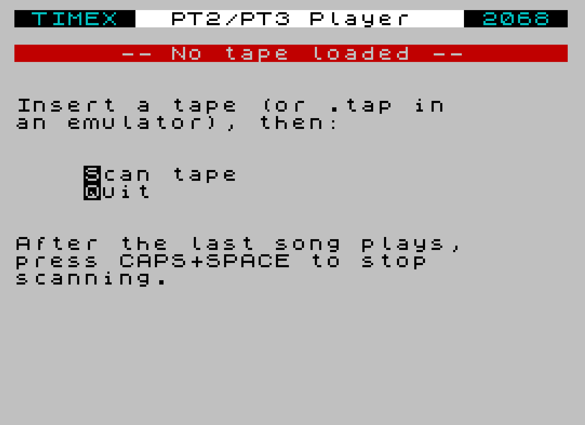
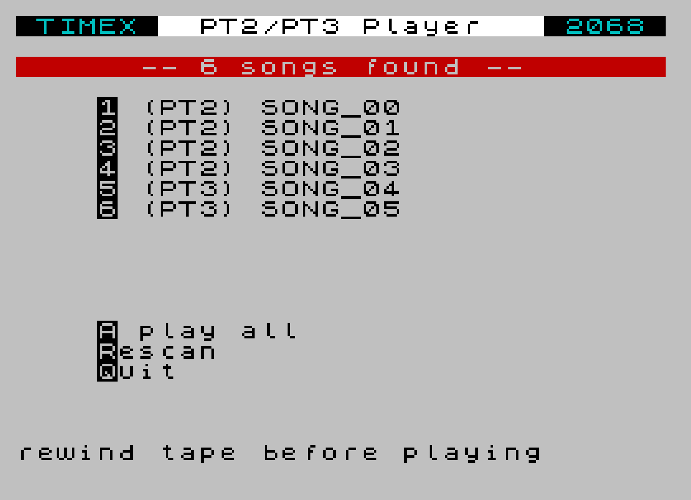

# TS Tracker — PT3 editor + PT2/PT3 player for the Timex/Sinclair 2068

Two companion apps for the **Timex/Sinclair 2068**:

- **`tracker2`** — **TS Tracker 2**, an all-machine-code PT3 song editor
  with an SQ-Tracker-style screen: three-channel pattern grid, sample and
  ornament editors, arrangement editor, follow-cursor playback with mutes
  and a VU, and tape load/save. Start a song from nothing or rework one
  loaded from tape. User manual: [docs/manual-v2.md](docs/manual-v2.md)
  (printable [PDF](docs/manual-v2.pdf)).
- **`pt3-player`** — a standalone music player that reads **ProTracker 2
  (`.pt2`) and Vortex Tracker II / ProTracker 3 (`.pt3`)** songs straight off
  cassette and plays them through the AY-3-8912.

The editor is written in Z80 assembly ([sjasmplus](https://github.com/z00m128/sjasmplus));
the player is C built with [z88dk](https://github.com/z88dk/z88dk) (SDCC
backend). Both embed S.V. Bulba's PTxPlay driver. Output is a Spectrum-format
`.tap` that loads on **any** emulator (zesarux, FUSE, ...) and on real
hardware via the **TS-PICO** in tape-emulation mode.

## The editor

| Pattern editor | Sample editor |
| --- | --- |
|  |  |
| Three voices with sample, envelope, ornament, volume and command per note; the menu strips name every command and its key. | Every PT3 sample bit: mixer flags, tone and noise offsets with accumulate, volume, amplitude slide. ENTER plays it. |
| **Playing** | **Arrangement** |
|  |  |
| The grid follows the song; 1/2/3 mute channels; a VU on the detail row. | The position list: type, insert, delete, loop point, new pattern, pattern length. |

What it does:

- **Pattern editing** with a piano keyboard, octave keys, rests, per-note
  sample / envelope / ornament / volume, PT3 commands with parameter entry,
  row envelope period and noise, insert/delete row, copy/paste pattern,
  transpose, edit step, and a preview of every note as you type it.
- **Instrument editors** for samples (up to 64 lines, every field PTxPlay
  reads) and ornaments, with create, resize, insert/delete line and a
  held-key preview.
- **Arrangement editor** and **song info** (title, author, speed).
- **Playback** from the current position with the editor following the
  music, loop-pattern mode, channel mutes and a VU.
- **Tape**: scan a tape into a directory, load a PT3 by name, save with a
  name and an auto-incrementing version; identical channel streams are
  de-duplicated on save.
- **PT3 exactly**: the song in memory *is* the PT3 file. One pattern at a
  time is decoded for editing and re-encoded canonically when you leave it;
  the codec is verified byte-for-byte against a Python reference on every
  pattern of the bundled songs. Saved files load in Vortex Tracker II.
- A song may use up to 85 patterns and 200 positions in a **13.5 KB** slot;
  the program returns cleanly to BASIC.

## Quick start

If you just want to try it, download **`ts-tracker.zip`** from the
[**Releases page**](https://github.com/factus10/TS-Tracker/releases/latest)
(the same files are kept in [`release/`](release/)). It contains
`tracker2.tap`, `pt3-player.tap`, the sample songs (`songs.tap`) and the
manual.

To build from source you need `sjasmplus` (editor) and `z88dk` (player) on
`PATH`. The Makefile exports `Z88DK_HOME` and `ZCCCFG` itself.

```sh
make tracker2          # build/v2/tracker2.tap   (the editor)
make pt3-player        # build/pt3-player.tap    (the player)
make songs-tape        # build/songs.tap         (every song in songs/, one per CODE block)
make release           # release/ts-tracker.zip  (all of the above + the manual)
make tracker2-demo SONG="songs/3BIT - Kenotron - KENO50 (Paradox version).pt3"
                       # build/v2/tracker2-demo.tap: boots straight into the editor with that song
```

Drop your own `.pt2` / `.pt3` files in `songs/` and re-run `make songs-tape`
to rebuild the song tape.

To try the editor in zesarux:

```sh
zesarux --machine ts2068 --tape build/v2/tracker2.tap
# At the start screen: N for a new song, or swap tapes (F5 -> Insert tape ->
# build/songs.tap), press S to scan, then the song's number to load it.
```

## Using the editor

Everything is on screen: the `SONG`, `EDIT` and `GOTO` strips list the
commands, each run with **SYMBOL SHIFT** + the yellow letter, and SYM+H
shows every key. The [manual](docs/manual-v2.md) has the full guide and a
"your first tune" walkthrough. In brief:

| Keys | Action |
| --- | --- |
| CAPS+5/6/7/8, joystick | Move (fields left/right, rows up/down) |
| `Z S X D C V G B H N J M`, `1`–`8` | Piano keys, octave |
| ENTER, SPACE | Rest, clear |
| SYM+A / L | Play from here (follows) / loop the pattern; `1 2 3` mute |
| SYM+O / P, SYM+F | Previous / next position, arrangement editor |
| SYM+E / R | Sample / ornament editor |
| SYM+C / V, SYM+T / Y | Copy / paste pattern, transpose channel |
| SYM+W / B / K | Row envelope period, row noise, edit step |
| SYM+S / D / N / G | Save, load (directory), new song, song info |
| SYM+I / X / Z, SYM+H / Q | Insert / delete row, clear channel; help, quit |

## Using the player

| Boot screen | Directory after a scan |
| --- | --- |
|  |  |

**On the empty / "no tape" screen:** `S` or SPACE scans the tape; `Q` or
ENTER quits to BASIC. **During a scan** the player reads each block and prints
its name; CAPS+SPACE stops the scan (needed on real hardware when the tape
ends). **On the directory screen:** `1`–`9` plays that song (rewind first),
`A` plays all, `R` rescans, `Q` quits. **While playing:** `1`/`2`/`3` mute
channels A/B/C, SPACE stops, CAPS+SPACE stops "play all".

Because cassettes are sequential, **rewind the tape (or restart the `.tap` in
your emulator) before each play**: the player reads forward from wherever the
tape is until it reaches the song you asked for.

Tape compatibility (both apps):

| Source                          | Works | Notes |
| ------------------------------- | :---: | ----- |
| `.tap` of CODE blocks in emulator |  ✓  | Both auto-looping and one-shot tape feed |
| Real cassette on a TS2068        |  ✓  | End a scan by hand when the tape runs out |
| TS-PICO SD card (tape mode)      |  ✓  | Mount the same `.tap`; works the same |

## Status

- [x] PT3 and PT2 playback through the AY-3-8912 (the player)
- [x] **TS Tracker 2** — the all-assembly editor described above, verified in
      ZEsarUX by five automated suites (codec parity on 100 patterns,
      arrangement, instruments, editing/playback/de-dup, real-time tape)
- [x] Tape directory scan, load by name, save with versioning
- [ ] PT2 import (convert on load); undo; per-channel copy/paste
- [ ] TS-PICO native file loading (load any `.pt3` by filename via TPI)

The original C editor (v1.2, `src/tracker.c`) is retired: it still builds
with `make tracker-classic` and its manual is [docs/manual.md](docs/manual.md),
but it is no longer part of the default build or the release.

## Build details

**Editor (`asm/v2/`)** — one CODE block at `$8000` (about 17.6 KB including
PTxPlay). Memory map: `$6A00` working pattern (the one pattern being edited,
decoded), `$7000` encoder staging, `$7C00` scratch (tape directory, preview
song, our IM2 vector table), `$8000–$C7FF` code, **`$C800–$FDFF` the song
slot** (the PT3 itself, 13.5 KB), `$FE00` stack. BASIC's own area below
`$6A00` is untouched, so Quit returns to BASIC. The program runs its own
interrupt handler (the ROM's writes system variables relative to IY, which the
codec uses as a pointer). `asm/v2/layout.inc` and `V2_SLOT_HEX` in the
Makefile are the single source of truth for the slot base. Design notes,
per-phase results and the memory map history are in
[docs/redesign-plan.md](docs/redesign-plan.md).

**Player (`src/pt3_player.c`)** — targets z88dk `+zx` (the TS2068 clibs are
sccz80-only, but the PT3 code needs SDCC); the AY backend talks directly to
the TS2068's `$F5`/`$F6` ports. C at `$8000`, PTxPlay at `$D700`, song slot at
`$E200` (~6.4 KB). `PLAYER_PTX_ORIGIN_HEX` / `PLAYER_SONG_BASE_HEX` in the
Makefile are the source of truth; PTxPlay's symbols are pulled into a generated
`ptxplay_addrs.h`.

**Tests (`tools/`)** — all drive ZEsarUX over its remote protocol on private
ports: `v2_codec_test.py` (Z80 decoder/encoder vs `pt3codec.py` on every
bundled pattern), `v2_arrange_test.py`, `v2_instr_test.py`, `v2_phase4_test.py`
(editing, playback follow/mutes, de-dup), `v2_tape_test.py` (load/save through
the real EXROM routines with the tape playing in real time), `v2_ui_smoke.py`
and `v2_shots.py` (screenshots). See `docs/zesarux-debugging-guide.md`.

## Credits

The driver core is **Vortex Tracker II PT3 player** by **Sergey Bulba**,
which has been carried across the ZX/MSX scene by:

- **S.V. Bulba** — original ZX Spectrum player ([https://bulba.untergrund.net](https://bulba.untergrund.net), now defunct)
- **Dioniso** — MSX adaptation (2005)
- **msxKun** — MSX ROM arrangements
- **SapphiRe** — asMSX version with split PLAY / PSG write
- **mvac7** — SDCC C wrapper

For this project we use Bulba's combined `PTxPlay.asm` (universal PT1 /
PT2 / PT3 driver), assembled with sjasmplus. The editor's screen layout
follows **SQ-Tracker**. The header-reading flow on the player's C side is
inspired by **Header5.tap** (T-S Horizons / T/S User Group / Bill Ferrebee,
1984).

Upstream:

- [github.com/mvac7/SDCC_PT3player_Lib](https://github.com/mvac7/SDCC_PT3player_Lib)
- [github.com/mvac7/SDCC_AY38910BF_Lib](https://github.com/mvac7/SDCC_AY38910BF_Lib)
- [github.com/electrified/rc2014-ym2149](https://github.com/electrified/rc2014-ym2149) (where we found PTxPlay.asm)

## Layout

```
asm/v2/
  tracker2.asm            top level: start, IM2 handler, includes
  layout.inc              memory map + shared constants
  screen.asm keys.asm     renderer (ROM font + custom glyphs), keyboard/joystick scan
  pt3dec.asm pt3enc.asm   PT3 pattern codec (byte-identical to tools/pt3codec.py)
  slot.asm                the song slot: splices, pointer fix-ups, commit, de-dup
  player.asm              PTxPlay glue: follow-play, mutes, VU, note preview
  editor.asm              pattern editor and SYMBOL SHIFT commands
  tape.asm dir.asm        EXROM tape trampolines, directory, load, save
  posedit.asm             arrangement editor
  songinfo.asm instr.asm  song info; sample and ornament editors
  data.asm vars.asm       strings, tables, glyphs, new-song template; variables
src/
  pt3_player.c            the player: picker UI, scan, directory, play loop, viz
  ay_ts2068.[ch]          AY-3-8912 backend (TS2068 ports $F5/$F6)
  pt_engine.[ch]          PTxPlay wrapper (INIT/PLAY/MUTE thunks, tempo)
  ts_io.[ch]              screen + keyboard primitives
  tracker.c               the retired C editor (make tracker-classic)
tools/
  pt3codec.py             the PT3 codec reference model
  v2_*.py                 ZEsarUX-driven test suites and screenshot capture
  mktap.py                raw binary -> .tap with a BASIC loader (+ extra CODE blocks)
  build_ptxplay_asm.py    rewrites PTxPlay.asm for our builds
  songs_to_tape.py        pack .pt2/.pt3 -> a single .tap of CODE blocks
vendor/PTxPlay/           S.V. Bulba's PTxPlay.asm
songs/                    the bundled .pt3 / .pt2 collection
docs/                     manuals, redesign plan, emulator notes, screenshots
release/                  prebuilt tapes + zip
build/                    generated artifacts (gitignored)
```
