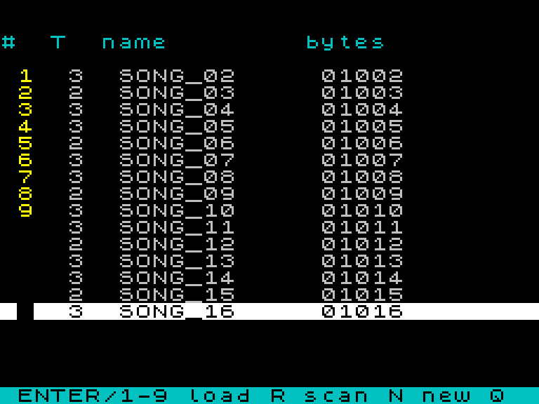
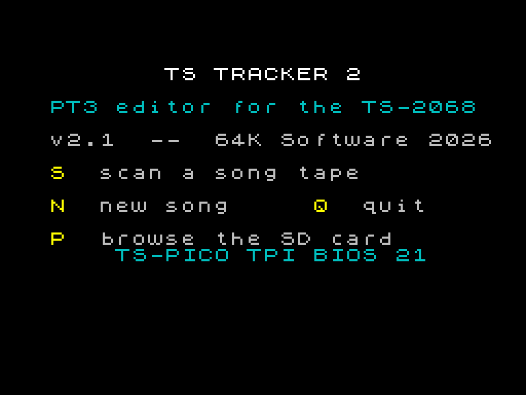
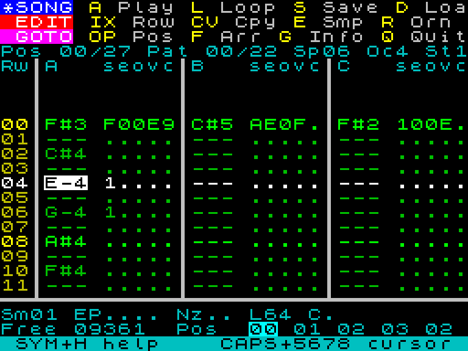
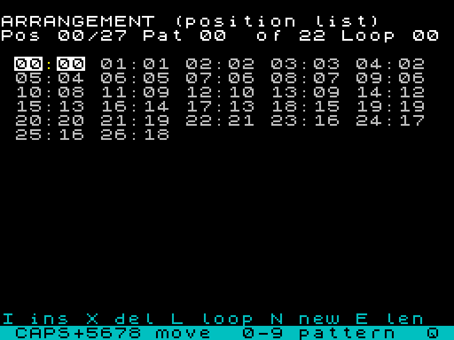
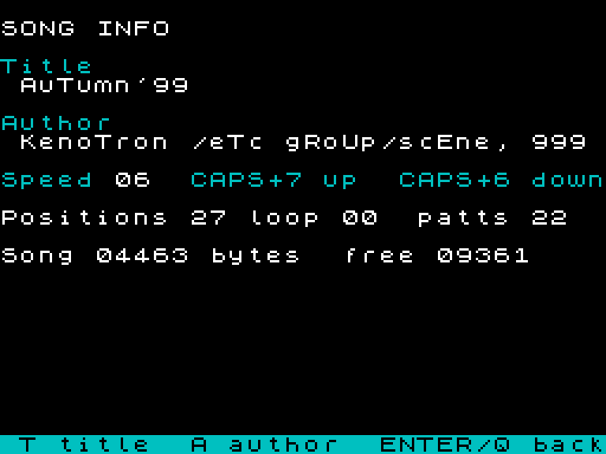
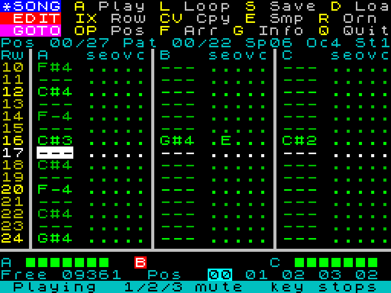
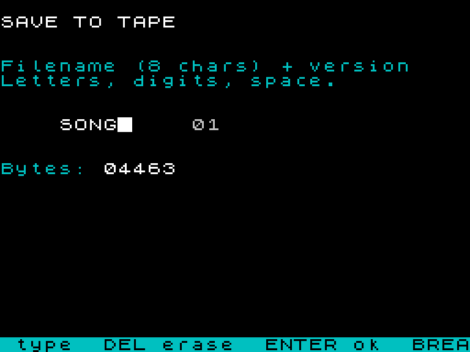

# Welcome

TS Tracker 2 turns your Timex Sinclair 2068 into a three-voice music
workstation. Load a **PT3** tune from tape and rework it, or start a new song
from nothing and build it up note by note --- no tape needed to begin. When
you are happy, TS Tracker 2 writes the song back to cassette as a standard
PT3 file that the TS Tracker Player, Vortex Tracker II on a PC, or any PT3
player can load.

The program is written entirely in machine code and drives the AY-3-8912
sound chip through the PTxPlay (Bulba) driver, the same engine used by the
player, so what you hear while editing is exactly what you will hear on
playback.

The screen follows the layout of SQ-Tracker, the classic Spectrum tracker:
three menu strips at the top name every command and the key that runs it, so
you rarely need this manual once the layout is in your fingers. The built-in
help page (SYMBOL SHIFT + **H**) lists every key on one screen.

# Loading the program

TS Tracker 2 is supplied as a `.tap` cassette image. Load it the usual way:

```
LOAD ""
```

then start the tape. The program is about 17 K and takes a minute or so to
load. When it has loaded, the **start screen** appears:

```
          TS TRACKER 2
   PT3 editor for the TS-2068
   v2.1  --  64K Software 2026

   S  scan a song tape
   N  new song     Q  quit

   P  browse the SD card
       TS-PICO TPI BIOS 21
```

- Press **S** to scan a song tape and pick a song to edit (see *Scanning a
  tape*).
- Press **N** to start a **new song**: an empty 64-row pattern, one sample,
  one ornament and speed 6 --- the same starting point Vortex Tracker gives
  you.
- Press **P** to browse the `.pt3` files on a **TS-PICO**'s SD card. The two
  bottom lines appear only on a TS2068 whose TS-PICO ROM is installed (see
  *The SD card (TS-PICO)*).
- Press **Q** to return to BASIC.

# Scanning a tape

Press **S** on the start screen, start the tape playing, and TS Tracker 2
reads every block header it finds. Each song's name appears in a
**directory** of up to 64 entries, fifteen to a screen, with its format (`3`
for PT3, `2` for PT2, `?` for anything else) and size in bytes. The border
flashes in the usual tape colours while a block is being read.

The scan ends by itself when the directory is full or when a name repeats
(emulators loop their tapes). On a real cassette the tape simply runs out, so
**press SPACE when the tape has finished** to end the scan.



On the directory screen the selected entry is shown inverted:

| Key | Action |
|-----|--------|
| CAPS + `6` / `7` | Move the selection down / up (the list scrolls) |
| ENTER | Load the selected song for editing (rewind first!) |
| `1`--`9` | Load the song on that row of the screen |
| `R` | Rescan the tape |
| `N` | Start a new song instead |
| `Q` | Back to the start screen |

Because cassettes are sequential you must **rewind before loading**: the
program reads forward from wherever the tape is, skipping blocks until it
reaches the one you asked for, and loads it. Press SPACE to abandon a load.

PT3 songs (ProTracker 3.x and Vortex Tracker II exports) load as they are.
A **PT2** song is **converted to PT3 as it loads**: every note, sample,
ornament, envelope and effect comes across, and saving writes a PT3. The
conversion follows the same rules the player uses to play PT2, so it sounds
the same. One difference to know about: PT2 sets the noise pitch per channel,
PT3 per row, so in the rare pattern where two channels set different noise
pitches on the same row the last one wins.

# The SD card (TS-PICO)



A TS2068 fitted with a **TS-PICO** running Gus Pane's TPI ROM can use the
Pico's SD card instead of a cassette. TS Tracker 2 notices that ROM at start
and shows its version on the start screen (`TS-PICO TPI BIOS 21`).

**A `.tap` on the card.** Put the Pico in SD mode from BASIC, mount a tape
image and load the editor the usual way:

```
SAVE "TPI:SDCARD"
LOAD "TPI:tracker2.tap"
LOAD ""
```

From then on every tape operation --- **S**, loading, SYM + `S` --- goes to
the mounted `.tap` through the Pico. There is nothing to rewind and no
"start recording" prompt: the program moves the Pico's tape pointer itself.

**Raw `.pt3` files.** Press **P** on the start screen and the directory shows
the `.pt3` (and `.pt2`) files in the card's current folder --- each under the
first ten characters of its file name, with its size --- exactly like a tape
directory (two files whose names start alike are told apart by their place in
the list). Move to a file and press ENTER to load it. SYM + `S` then **saves
back to the card** as a file named `NAME    nn` (the name you typed and the
version number) in the same folder. The program switches the Pico to raw
files while it browses or saves and back to `.tap` files afterwards, so
BASIC finds the card as it left it; Q on the start screen restores the
tape/SD mode too.

If the Pico refuses a command, `Pico error nn` appears on the bottom row:
`nn` is the TPI status code (`FF` means it did not answer within the
protocol's timeout, or BREAK was pressed). The SD-card part of TS Tracker 2
is new: it was checked in the emulator against the frames the TPI ROM
itself sends, but had not yet met a real TS-PICO when this manual was
written, so treat an empty directory after **P** as something to report
rather than as an empty card.

# The pattern editor



A *pattern* is a block of up to 64 **rows**; each row holds one event for
each of the three sound channels **A**, **B** and **C**. A song plays its
patterns one after another in the order given by its **position list**.

The screen:

- **Rows 0--2, the menu strips.** `SONG`, `EDIT` and `GOTO` list the commands.
  Each yellow letter is the key that runs that command, always pressed with
  **SYMBOL SHIFT**. A `*` in front of `SONG` means the song has changes that
  are not yet on tape.
- **Row 3, the info line.** `Pos 00/27` is the current position and the
  number of positions; `Pat 00/22` the pattern at that position and the
  pattern count; `Sp06` the song speed; `Oc4` the octave used for note entry;
  `St1` the edit step.
- **The grid.** Fifteen rows are visible; the cursor row is always the
  highlighted row in the middle and the pattern scrolls under it. Each
  channel cell reads `NNN seovc`: the **note** (`C#4`; `---` nothing; `R--`
  a rest) and five one-character fields --- **s**ample, **e**nvelope,
  **o**rnament, **v**olume and **c**ommand. A `.` means the field is not set.
  Rows beyond the pattern's length are dimmed.
- **Row 21, the detail line**, `Sm.. EP.... Nz.. Lnn C. .. .. ..`: the cursor
  cell's sample (two hex digits), the row's envelope period and noise, the
  pattern length, and the cursor cell's command with its parameter bytes.
- **Row 22.** `Free` is the room left for the song when saved; `Pos` shows
  five positions around the current one.
- **Row 23**, the hint line, tells you what the keys do right now, and is
  where questions and messages appear.

## Moving around

| Key | Moves |
|-----|-------|
| CAPS SHIFT + `7` / `6` | Up / down a row (hold to repeat) |
| CAPS SHIFT + `5` / `8` | Left / right a field, across channels |
| SYM + `O` / `P` | Previous / next position |
| SYM + `F` | The arrangement editor (jump anywhere) |

A joystick in the left port moves the cursor too (fire = SPACE).

Moving to another position saves your edits into the song automatically.
There is no separate "commit" step.

## Entering notes

With the cursor on the **note** field, the letter keys are a piano:

```
   S D   G H J          C# D#   F# G# A#
  Z X C V B N M         C  D  E F  G  A  B
```

- `1`--`8` set the **octave** for the next notes. If the cursor is on a note,
  that note is moved to the new octave as well.
- ENTER enters a **rest** (`R--`): the channel falls silent from this row.
- SPACE clears the whole cell.
- A new note takes the **current sample** (the last sample you typed into a
  cell, or the one you last edited in the sample editor).
- After a note or rest the cursor moves down by the **edit step** (SYM + `K`
  to change it, `0`--`9`; step 0 keeps the cursor on the row).

Every note you type is played while you hold the key, with the cell's own
sample, ornament and envelope, so you can hear what you are writing.

## The other fields

Move the cursor right onto a field and type its value. SPACE clears the field.

- **s** sample, `1`--`9` and `A`--`V`: which instrument plays this note
  (1--31, in Vortex Tracker's base-32 letters).
- **e** envelope, `1`--`E`: the hardware envelope shape for this note; `0`
  switches the envelope **off** for this channel.
- **o** ornament, `0`--`F`: the ornament (arpeggio / note-offset table).
- **v** volume, `1`--`F`: the channel volume for this note.
- **c** command, `1`--`9`: a PT3 effect (see below); `0` clears it.

A field on a row without a note turns the row into an *event without a
note*: the change takes effect there, the note carries on.

## Commands and their parameters

Typing a command digit on the **c** field sets the command and opens a small
prompt on the hint line for its parameters, in hex. Type the bytes and press
ENTER; CAPS SHIFT + SPACE (BREAK) keeps the old parameters.

- `1` --- **tone slide**: delay, step (lo, hi). A positive step slides up.
- `2` --- **portamento** to the note: delay, step (lo, hi).
- `3` --- **sample position**: start the sample at this line.
- `4` --- **ornament position**: start the ornament at this line.
- `5` --- **vibrato**: frames on, frames off.
- `8` --- **envelope slide**: delay, step (lo, hi).
- `9` --- **speed**: set the song speed from this row.

The detail line shows the command and its bytes for the cursor cell. A lone
digit typed into a prompt is taken as itself (`8` means `08`).

## Envelope period and noise

Two values belong to the **row** rather than to a channel:

- SYM + `W` sets the row's **envelope period** (four hex digits). Because the
  PT3 format stores the period together with an envelope shape, a channel on
  that row must have an envelope shape set first.
- SYM + `B` sets the row's **noise pitch** (`00`--`1F`; leave the field blank
  for "no change").

Both appear on the detail line as `EP` and `Nz`.

## Rows, channels, patterns

- SYM + `I` (or CAPS + `1`): insert a row at the cursor; the last row falls
  off the end.
- SYM + `X` (or CAPS + `0`): delete the cursor row; a blank row appears at
  the end.
- SYM + `Z`: clear the cursor's channel over the whole pattern (asks first).
- SYM + `T` / `Y`: transpose the cursor's channel up / down a semitone; hold
  CAPS as well for an octave.
- SYM + `C`: copy the current pattern. SYM + `V`: paste it over the pattern
  you are in.
- CAPS + SYM + `C`: copy just the cursor's channel; CAPS + SYM + `V`: paste it
  onto the cursor's channel of the pattern you are in (a pasted note that uses
  an envelope brings its row's envelope period along if the row has none).
- SYM + `U`: **undo** the last edit to the pattern. A second SYM + `U` redoes
  it. One step is kept, and it is forgotten when you leave the pattern.

Copy remembers *which* pattern (or channel) you copied, so if you edit the
original before pasting you paste the edited version.

# The arrangement editor



SYM + `F` shows the **position list**: every position as `pp:PP` (position
number : pattern number), five to a row. The loop position's `:` is yellow.

| Key | Action |
|-----|--------|
| CAPS + `5` `6` `7` `8` | Move |
| `0`--`9` | Type a pattern number into the cursor position |
| `I` | Insert a copy of the cursor position before it |
| `X` | Delete the cursor position |
| `L` | Make the cursor position the loop point |
| `N` | Create a new, empty pattern and put it here |
| `E` | Set the length (1--64 rows) of this pattern |
| ENTER or `Q` | Back to the pattern editor, at the cursor |

A song may have up to 85 patterns and 200 positions, subject to the free
memory shown on the editor's `Free` counter.

# Song info



SYM + `G` shows the song's **title** and **author** (up to 32 characters
each; press `T` or `A` to edit them in place), its **speed** (CAPS + `7` /
`6`; 1 is fastest), the position, loop and pattern counts, and the song's
size in bytes against the space available. ENTER or `Q` returns.

# The instrument editors


A PT3 **sample** is the instrument a note plays with: a list of lines, one
per frame, each setting the volume and the tone/noise/envelope mix, plus
optional pitch and noise offsets. When the sample reaches its last line it
jumps back to its **repeat** line and loops from there. An **ornament** is a
list of semitone offsets played one per frame --- the classic chip arpeggio.

SYM + `E` opens the sample editor on the current sample, SYM + `R` the
ornament editor. Both show:

- the instrument's number, **Len** (lines) and **Rep** (repeat line) at the
  top; the Rep line's number is yellow in the list;
- sixteen lines a page; CAPS + `7` / `6` move the cursor line, CAPS + `5` /
  `8` move between the fields of a sample line.

## Sample line fields

```
Ln  TNE  Tone ^  Ns ^  V  A
00  T-E  +0000_  +00_  F  _
```

- `T` `N` `E` --- tone, noise and envelope on (`-` = off). SPACE toggles the
  one under the cursor.
- `Tone` --- pitch offset in tone-period steps, signed. Type digits (they
  roll in from the right); SPACE changes the sign; CAPS + `0` zeroes it.
- `^` --- `^` means the offset accumulates frame by frame (a slide), `_` that
  it is fixed. SPACE toggles.
- `Ns` --- noise pitch offset, or the envelope offset when noise is off,
  --16..+15. Digits, SPACE for the sign, CAPS + `0` zeroes.
- `^` --- accumulate that offset. SPACE toggles.
- `V` --- volume 0--F. Type a hex digit.
- `A` --- amplitude slide: `_` none, `+` up, `-` down. SPACE cycles.

## Instrument editor keys

| Key | Action |
|-----|--------|
| `O` / `P` | Previous / next instrument |
| `L` | Set the length, 1--64 lines (grows with empty lines) |
| `R` | Set the repeat line |
| `I` / `X` | Insert an empty line before the cursor / delete it |
| ENTER | Play the instrument (C of the octave) while held |
| `Q` | Back to the pattern editor |

An instrument that has no data yet shows `(no data -- L creates it)`; any
edit, or `L`, creates it. If two instruments share the same data (a new song
starts that way), editing one gives it its own copy first.

Leaving the sample editor makes the sample you were on the **current sample**
for note entry.

## Making different sounds

- **A plain tone**: one line, `T` on, volume `F`, repeat 0.
- **A decaying pluck**: several lines with falling volumes (`F C 9 6 3 1`),
  repeat on a final silent line (volume 0) so the note stops.
- **A snare**: `N` on and `T` off, volumes falling fast, a low `Ns` value for
  a sharp crack; repeat on a silent last line.
- **A slide**: set `Tone` to a few steps and turn its `^` on --- the pitch
  bends every frame.
- **An envelope bass**: `E` on, `T` off, volume irrelevant. Give the note an
  envelope shape (`8` or `A`) in the pattern; TS Tracker 2 sets the envelope
  period to the note's pitch when you preview, and you set it per row with
  SYM + `W` in the pattern.
- **An arpeggio**: an ornament of `+00 +04 +07` with repeat 0 turns a single
  note into a major chord.

# Hearing your work



| Key | Action |
|-----|--------|
| SYM + `A` | Play the song from the current position |
| SYM + `L` | Loop the current pattern |
| `1` `2` `3` (while playing) | Mute / unmute channel A, B, C |
| any other key | Stop |

While playing, the grid follows the music --- the playing row is the
highlighted one --- and the detail line becomes a VU meter for the three
channels. When you stop, the cursor is on the row and position that was
playing, so you can fix what you just heard.

# Saving to tape



SYM + `S` opens the save screen. Type a name of up to eight characters
(letters, digits and spaces), then ENTER. Set your recorder to record, press
any key, and the song is written as one CODE block named `NAME    nn`, where
`nn` is a version number that counts up with every save in this session, so
you never overwrite the previous take. Before writing, the program tidies the
song: any channel streams that became identical are stored once.

On a TS-PICO in SD mode there is no recording prompt: the block goes into
the mounted `.tap`, or --- when the song came from the SD-card browser --- the
title reads `SAVE TO SD CARD` and the song is written as a raw `.pt3` file of
that name in the card's current folder.

The saved file is an ordinary PT3: the TS Tracker Player plays it from tape,
and it loads straight into Vortex Tracker II on a PC.

# Walkthrough: your first tune

A short loop with a melody, a bass and a drum --- from a blank machine to a
saved tape.

**1. Start a new song.** From the start screen press **N**. You land in the
pattern editor on an empty pattern 0, cursor on row 0, channel A.

**2. A melody on channel A.** The octave is 4. Place a note every four rows:
row 0 **Z** (C), then CAPS + `6` three times and **B** (G) on row 4, **N**
(A) on row 8, **M** (B) on row 12. Press SYM + `A` to hear it; any key stops.

**3. A bass on channel B.** CAPS + `8` five times moves to channel B's note
field; CAPS + `7` back to row 0. Press **2** for octave 2, then **Z** on row
0 and **V** (F) on row 8.

**4. A drum on channel C.** Move to channel C, row 4: press **Z**; row 12:
**Z** again. Now make the sound: with the cursor on one of those notes, move
right to the **s** field and type **2** --- the notes now use sample 2, which
does not exist yet.

**5. Build the snare.** SYM + `E` opens the sample editor; press **P** to go to
sample 2 (`(no data)`), then **L**, type `4`, ENTER: four lines. On each line
SPACE the `T` off and the `N` on (CAPS + `8` moves between them); set the
volumes to `F 9 4 0` (move to the `V` column and type them); press **R**, type
`3`, ENTER so the hit repeats on its silent last line. Press ENTER to hear it,
then **Q**.

**6. Tempo.** SYM + `G`, CAPS + `6` to speed 5, ENTER.

**7. Play it all.** SYM + `A`. The grid follows the song.

**8. Save it.** SYM + `S`, type `FIRST`, ENTER, start recording, any key.
`FIRST   01` is on the tape, and the `*` before `SONG` goes away.

# The help screen

SYM + `H` shows every key on one screen. Any key returns to the editor.

# Quick key reference

**Pattern editor** (commands are SYMBOL SHIFT + letter):

| | |
|---|---|
| `A` play `L` loop | `S` save `D` load / directory |
| `I` `X` insert / delete row | `Z` clear channel `N` new song |
| `C` `V` copy / paste pattern (+CAPS = channel) | `T` `Y` transpose (+CAPS = octave) |
| `U` undo / redo | |
| `O` `P` position | `F` arrangement `G` song info |
| `E` samples `R` ornaments | `W` envelope period `B` noise |
| `K` edit step | `H` help `Q` quit |

CAPS + `5` `6` `7` `8` move; `Z S X D C V G B H N J M` piano; `1`--`8` octave;
ENTER rest; SPACE clear; on a field, its value.

**Directory:** CAPS + `6` `7` select; ENTER or `1`--`9` load; `R` rescan;
`N` new; `Q` back. **Start screen:** `S` tape, `P` SD card, `N` new, `Q` quit.

**Everywhere:** CAPS + SPACE (BREAK) cancels a prompt or a tape load.

# Limits and notes

- A song may use up to **85 patterns** and **200 positions**; the whole
  song (instruments and patterns) must fit **11.5 K** when saved. The `Free`
  counter on row 22 shows the room left, including the pattern you are
  editing.
- TS Tracker 2 edits **PT3** songs. A **PT2** song is converted to PT3 when
  it is loaded (see *Scanning a tape*); a PT2 bigger than about 5 K may not
  leave room for the conversion.
- Only rows that carry a note, a rest or a field change are stored, so a
  sparse pattern costs almost nothing; a noise change on an otherwise empty
  row is stored as an empty event.
- The envelope period belongs to a row and is written with an envelope
  shape; set the shape before the period.
- Instruments are limited to 64 lines. Samples 1--31 and ornaments 1--15 are
  editable; ornament 0 is the "no ornament" ornament every song has.
- The tape directory holds 64 entries. On a TS-PICO the raw-file browser
  shows the current folder only; change folders from BASIC
  (`SAVE "TPI:CD name"`) before loading the editor.

# Credits

TS Tracker 2 is a 64K Software production for the Timex Sinclair 2068. It
uses the PTxPlay AY replay driver by Sergey Bulba, shared with the TS
Tracker Player, and takes its screen layout from SQ-Tracker.

Happy composing.
