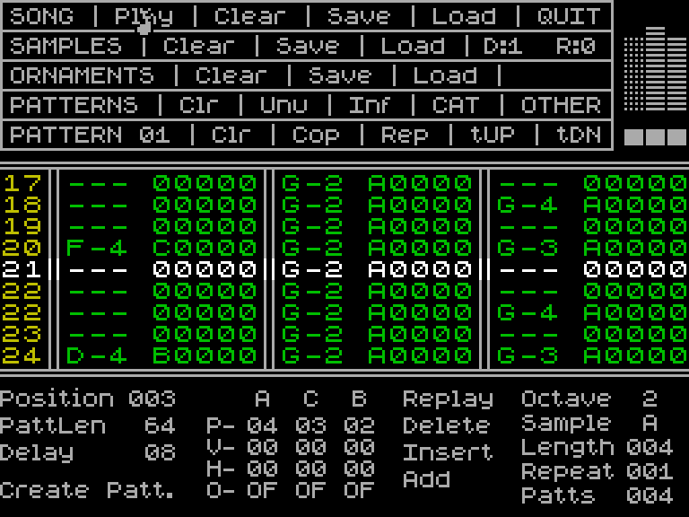
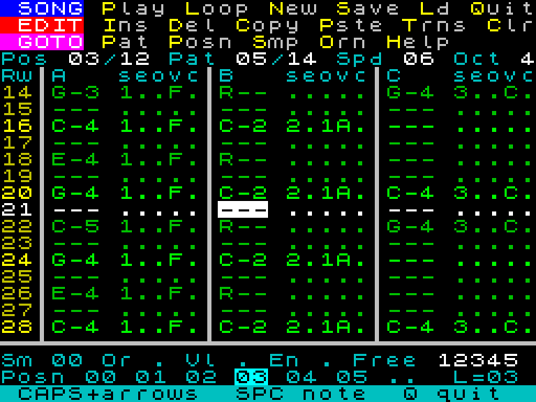
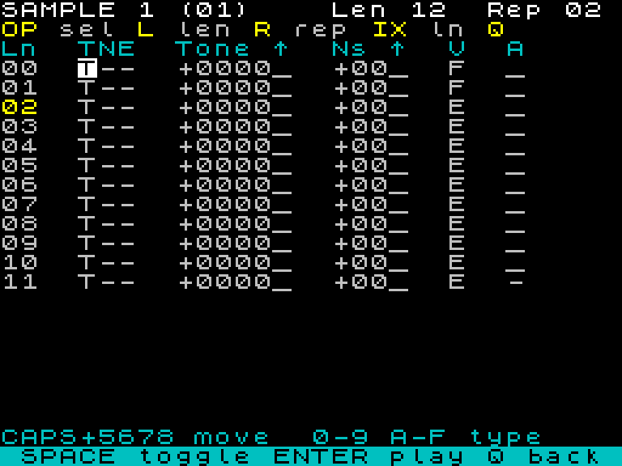
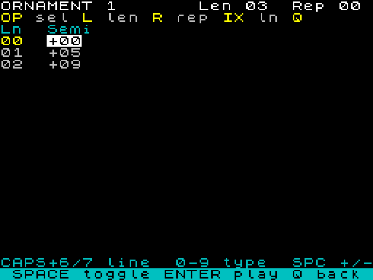
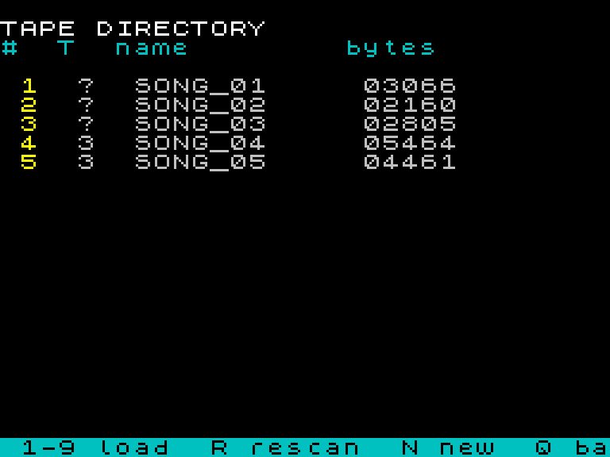
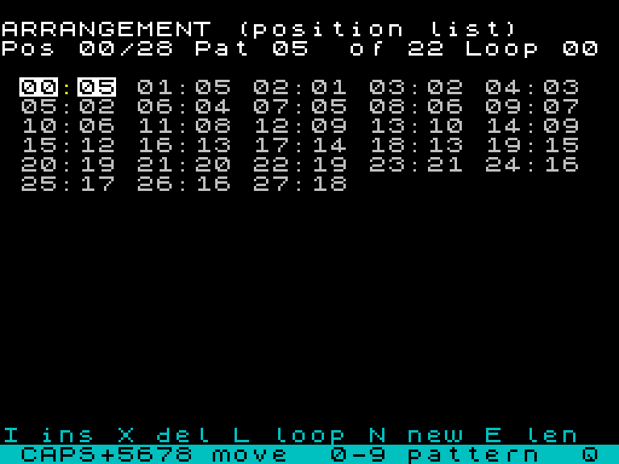
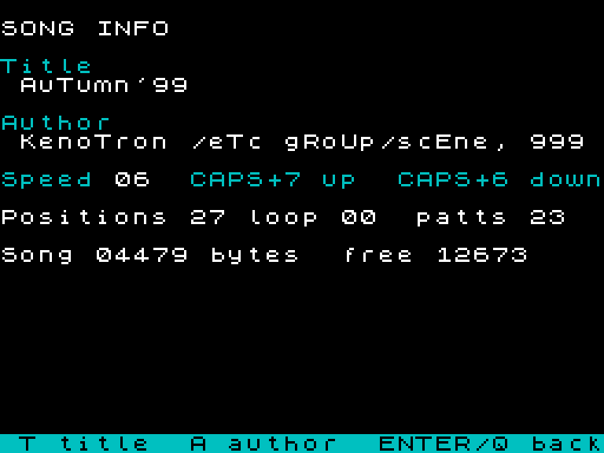
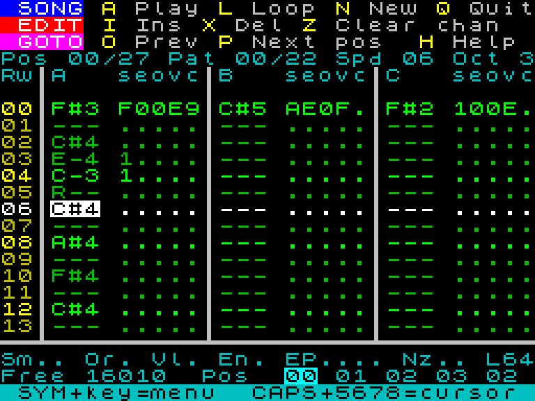

# TS Tracker v2 — SQ-Tracker-style interface, all-assembly rewrite

*Assessment, interface design, memory map and phased plan. Written 2026-09-22 on
branch `claude/ts-tracker-interface-redesign-1ca94e`. Companion proof of
concept: `asm/ui_poc.asm` (`make asm-poc`).*

| SQ-Tracker (Spectrum, 1993) — the target idiom | TS Tracker v2 proof of concept, running on the emulated 2068 |
| --- | --- |
|  |  |

---

## 1. Where we are (measured)

The shipped editor (`src/tracker.c`, v1.2) works, but it is boxed in on every
side by the way it is built:

| Fact | Value | Source |
| --- | ---: | --- |
| Editor source | 2,819 lines of C (z88dk / SDCC) | `wc -l` |
| Compiled image | **21,577 B** (`$8000`–`$D449`) | this build |
| PTxPlay (PT3-only), separate CODE block | 2,275 B (`$D500`) | Makefile |
| Decoded song model | 8,064 B at `$6000` (14 patterns × 576 B) | `tracker.c` |
| Song slot (`$DE00`–`$FAFF`) | **7,424 B** | Makefile |
| Headroom for new editor code | ≈ 180 B before the map has to move again | `$D449` vs `$D500` |
| Full rebuild | **3 min 44 s** (SDCC at `-SO3 --max-allocs-per-node200000`) | `time make tracker` |

How the UI is drawn today: every character goes through the ROM's `RST $10`
print routine with AT/INK/PAPER/INVERSE control codes, and every key is polled
with `IN` followed by a "wait until released" loop. That has three visible
consequences:

- **Redraws are slow.** A 16-row grid repaint is ~500 ROM prints; the ROM print
  path alone measures 12 frames (0.2 s) for that area on the 2068 (§2), and v1
  adds INVERSE/PAPER toggling and per-cell logic on top. Whenever the cursor
  crosses the window edge the whole grid re-paints; you can see it.
- **No auto-repeat.** Holding a cursor key moves one row. Getting from row 0 to
  row 63 is 63 key presses.
- **Only note + sample are visible in the grid.** Volume, ornament and noise are
  hidden behind the `U` mode-cycle (Oct → Vol → Smp → Orn → Noi), which also
  steals the hex letters from the piano while active.

Structurally, the arrangement (position list, loop point) is not editable, there
is no copy/paste/transpose, playback cannot follow the cursor, and the PT3
command column (glissando, portamento, vibrato, envelope, speed) is not
represented in the model at all.

Every one of these is fixable in C in isolation. The problem is that the image
is full: the last round of features had to *buy* their bytes by shrinking the
song slot (`PTX_ORIGIN` went `$D700 → $DAC0 → $D500`), and the hardware-envelope
editor is already parked on a branch because its 1.9 KB would cut the slot back
to ~5.6 KB. The June optimisation review (`docs/optimization-review.md`) got
the easy 4 KB back (CRT diet, PT3-only PTxPlay) and concluded that hand-tuning
individual C functions has poor return: SDCC's output for this kind of
byte-bashing code is fragmented across hundreds of small blocks.

## 2. Should it be rewritten in machine code? Yes — for RAM first, feel second

The 2068 has 64 KB and we need four things in it at once: the screen (6.9 KB),
the editor, the decoded model, and the PT3 song slot. Only one of those is
elastic — the editor — and in C it costs ~22 KB. A comparable Spectrum tracker
written in assembly (SQ-Tracker's editor, Pro Tracker 3, Sound Tracker) is
8–13 KB *including* its player. That is the whole argument: the C toolchain is
spending roughly 12 KB of RAM on codegen overhead, and that 12 KB is exactly
what the song slot and a richer UI need.

### What the proof of concept shows

`asm/ui_poc.asm` is the proposed pattern-editor screen written from scratch in
sjasmplus: three menu bars with hot-key letters, info line, boxed three-channel
grid (15 rows, cursor row pinned to the centre, beat rows brightened), a
per-cell detail panel, position strip and hint bar. It renders straight into
the display file using the ROM font at `$3C00`, reads the keyboard matrix
directly, auto-repeats (0.3 s delay, then 20 steps/s), navigates a six-field
cursor across the three channels, and has SPACE/ENTER/DELETE/octave editing
primitives over a dummy 64-row pattern.

| Metric | v1 (C) | v2 PoC (asm) |
| --- | ---: | ---: |
| Code + data for the screen/keyboard layer | ≈ 5–6 KB (`show_pattern` 2,845 B + `draw_*`/`put_*`/`key_*` helpers, per the optimisation review) | **2,015 B** for a richer screen (2,223 B with the two benchmark aids) |
| Full 15-row grid repaint (**measured**, FRAMES counter, ZEsarUX TS2068) | ROM `RST $10` path: **12.2 frames ≈ 0.20 s** (same 15×32 area, AT+PAPER codes per row, plain glyphs — v1 adds INVERSE toggles and per-cell logic on top) | **3.6 frames ≈ 0.06 s**, unoptimised: `put_char` still saves/restores four register pairs per glyph; ~1.5–2 frames is realistic |
| Build time | 3 m 44 s | 0.004 s |
| Key auto-repeat | none | yes (tunable constants) |
| Fields visible per cell | note, sample | note, sample, envelope, ornament, volume, command |

The PoC is verified in ZEsarUX (TS2068 machine): boots from its own `.tap`
(`tools/mktap.py`), draws correctly, single-step and held cursor moves behave,
SPACE writes a note, ENTER a rest. Press `B` for the renderer benchmark and `N`
for the ROM-print benchmark (results on the hint row). It is not a tracker yet:
no PT3 codec, no PTxPlay, no tape, dummy data. Its job was to answer "is the step-up real?" —
it is.

### Projected v2 footprint

| Component | Estimate | Basis |
| --- | ---: | --- |
| Screen + keyboard + menus + pattern editor | 3.0 KB | PoC is 2.0 KB with editing stubs |
| PT3 decoder + encoder + rebuild | 1.2 KB | C versions are 2,016 B of SDCC output; ~40 % in asm is typical |
| Sample / ornament editors | 1.5 KB | C: `se_draw` + `show_instr_editor` + `instr_resize` = 2,048 B |
| Tape I/O, directory, save prompt | 1.2 KB | trampolines are already asm; UI shrinks |
| Position editor, help, strings, tables | 1.5 KB | |
| PTxPlay (PT3-only) linked in the same binary | 2.3 KB | today's 2,275 B; drops the second CODE block and `ptxplay_addrs.h` |
| **Total** | **≈ 10.5–11 KB** | vs 23.9 KB (21.6 KB C image + 2.3 KB PTxPlay) today |

That frees ≈ 13 KB. Spent on the song slot it takes the slot from 7.4 KB to
≈ 20 KB; spent on the model it doubles the pattern count. See §4.

### What a rewrite does *not* fix, and the risks

- **The AY and PT3 stay the same.** No new sounds appear; the gains are RAM,
  UI density and responsiveness.
- **Correctness of the codec.** `decode_channel_row` / `encode_channel` /
  `rebuild_song` were verified byte-for-byte in June. Porting them is the one
  place a bug would silently corrupt songs. Mitigation in §6: the C encoder
  becomes the reference oracle in an automated round-trip test.
- **Effort.** Roughly 5–7 k lines of assembly across four phases. Each phase
  below ends in a loadable tape, so there is never a long dark period.
- **Two code bases during the transition.** Keep `src/tracker.c` building as
  `tracker-classic` until v2 reaches feature parity, then retire it. The player
  (`pt3_player.c`) is untouched throughout.

### Alternative considered: hybrid (C logic + asm renderer)

Rewriting only the screen/keyboard layer in asm and calling it from C would
recover ~3 KB and the responsiveness, but SDCC's codegen for the codec,
editors and tape UI is the bulk of the image, the 4-minute build stays, and the
song slot barely moves. It also means maintaining a C↔asm calling convention
around IX and the CRT. Not recommended.

**Recommendation: full assembly rewrite, phased, PTxPlay linked into the same
binary, the C tracker kept alongside until parity.**

## 3. Interface design — SQ-Tracker idiom, adapted to PT3 and 32 columns

SQ-Tracker's screen is three regions: a block of menu strips at the top, a
boxed grid with the cursor row held in the middle and the pattern scrolling
under it, and a dense status panel underneath. Its data model differs from ours
(99 single-channel patterns combined per position; 26 lettered samples) so we
borrow the *layout and behaviour*, not the file format — PT3 stays, because
that is what every player and Vortex Tracker understand.

### Screen map (32 × 24)

```
row  0   [ SONG ] Play Loop New Save Ld Quit      menu strip 1 (hot letters bright yellow)
row  1   [ EDIT ] Ins Del Copy Pste Trns Clr      menu strip 2
row  2   [ GOTO ] Pat Posn Smp Orn Help           menu strip 3
row  3   Pos 03/12 Pat 05/14 Spd 06 Oct 4         info line (values bright white)
row  4   Rw│A   seovc│B   seovc│C   seovc         column header
row  5   ┐
  …      │  15 grid rows; the cursor row is ALWAYS screen row 12 (centred)
row 19   ┘
row 20   ──┴─────────┴─────────┴─────────         rule
row 21   Sm 02 Or 1 Vl A En . Free 12345          cursor-cell detail + free bytes
row 22   Posn 00 01 02 [03] 04 05 ..  L=03        position strip, loop point
row 23   ▐ hint / prompt / confirmation bar ▌      inverse cyan
```

Rows 22–23 are used (we own the display file; the BASIC "lower screen" does
not exist for us).

### The cell: `NNN SEOVC` — nine characters per channel

| Column | Field | Display |
| --- | --- | --- |
| 0–2 | Note | `C-4`, `A#3`; `---` empty; `R--` rest (PT3 release) |
| 4 | Sample 0–31 | one base-32 character `1…9 A…V`, `.` = none — Vortex Tracker's convention |
| 5 | Envelope 0–F | hex digit, `.` = none |
| 6 | Ornament 0–F | hex digit, `.` = none |
| 7 | Volume 0–F | hex digit, `.` = unchanged |
| 8 | Command 1–9 | hex digit, `.` = none; parameters shown/edited on the detail row |

`2 + 1 + 9 + 1 + 9 + 1 + 9 = 32`, which is exactly SQ-Tracker's arithmetic.

Colours (SQ palette): black paper; row numbers yellow, bright on beat rows
(every 4th); notes green, bright on beat rows; cursor row bright white; the
cursor *field* black-on-white; separators white.

### Cursor and keys

The cursor has a row, a channel and a **field**. Input is field-aware, which
removes the `U` mode-cycle entirely:

| Field under cursor | Keys |
| --- | --- |
| Note | piano `Z S X D C V G B H N J M` + `,` (C of next octave); `1–8` set octave (and retune an existing note); ENTER = rest; SPACE = clear |
| Sample / Env / Orn / Vol / Cmd | `0–9 A–F` (`G–V` for samples ≥ 16) type the value directly; SPACE clears |

| Always | |
| --- | --- |
| CAPS + 5 / 6 / 7 / 8 | left / down / up / right — with auto-repeat; joystick does the same |
| CAPS + 1 (EDIT) / CAPS + 0 (DELETE) | insert row / delete row (all three channels) |
| SYMBOL SHIFT + letter | the menu-strip commands: SYM+P Play, SYM+L Loop pattern, SYM+N New, SYM+S Save, SYM+D Load/Dir, SYM+Q Quit, SYM+I/X Ins/Del row, SYM+C/V Copy/Paste pattern, SYM+T Transpose, SYM+Z Clear, SYM+F Go to pattern, SYM+O Position editor, SYM+E/R Sample/Ornament editor, SYM+H Help |
| O / P | previous / next pattern (kept from v1 — they sit on the top row and are not piano keys) |

Using SYMBOL SHIFT for commands gives every plain letter back to the piano (v1
had to move Save and Help off `S`/`H`) and is exactly what the menu strips
document on screen. The strips are a live legend, not a mouse target — the
2068 has no mouse; the joystick moves the cursor.

### Screens beyond the pattern editor

- **Position editor** (SYM+O) — SQ's `Position / Replay / Delete / Insert /
  Add`: the PT3 position list as a horizontal strip (row 22 already previews
  it), with insert/delete/replace of a position, set loop point (`L=`), and
  *create new pattern* (SQ's `Create Patt.`). This is the arrangement editing
  v1 never had.
- **Sample and ornament editors** (SYM+E / SYM+R) — same content as today's
  full-fidelity editors (every byte, `TN` mixer toggles, `Ns` noise pitch,
  create/resize) re-skinned in the new renderer, plus SQ's `Length` / `Repeat`
  (loop) fields in the header and a live preview note on SPACE.
- **Playback** — play song from the current position, loop current pattern,
  and **follow mode**: the grid scrolls under the fixed cursor row while the
  song plays, per-channel mute on `1 2 3` (SQ's `O- ON/OF`), a small
  three-channel VU in the menu-strip gutter (v1's player already has the bars).
- **Song / info screen** — PT3 title and author (editable), speed, positions,
  loop; the tape directory and New/Load/Save flow as today.

### Keeping what already works

The splash → `N`ew / `S`can → directory → edit flow, tape names with the
auto-incrementing version suffix, the confirm-before-clear idiom, the free-RAM
counter and the 60→50 Hz playback divider all carry over. The TIMEX banner
gives way to the menu strips, but the title screen keeps the period look.

## 4. Memory map for v2

Verified from the HOME ROM listing (`NEW` at `$0D7F`–): the 2068 keeps its
**BASIC machine stack at `$6000`–`$61FF`** (`MSTBOT` = `$6200`), the dispatcher
above it, `CHANS` at `$6840` and the BASIC program (`PROG`) at `$6856`. The v1
editor overwrote all of this with its model at `$6000`, which is why it never
returned to BASIC cleanly.

### Phase-1 design change: the song slot *is* the model

v1 decoded every pattern into an 8 KB RAM model (14 patterns max — and every
bundled song has 13–31 patterns, so v1 silently dropped the rest). v2 keeps the
PT3 byte stream in the slot as the single source of truth and decodes **one
pattern at a time** into a 1.5 KB working buffer (`WP`). Leaving the pattern
(or playing/saving) re-encodes it canonically and **splices** the new channel
streams into the slot in place — deleting the old streams if no other pattern
shares them, inserting the new ones, and fixing every pointer that moves
(pattern table, 32 sample pointers, 16 ornament pointers). Edits still persist
automatically; there is no user-visible commit. The pattern count is now bounded
only by the slot. The slot started at 20 KB with a clean return to BASIC; Phases
2 and 3 each moved its base up 2 KB to make room for code (current map below):

| Region | Range | Size | Notes |
| --- | --- | ---: | --- |
| Display file + attributes | `$4000–$5AFF` | 6,912 | |
| System variables, BASIC stack, dispatcher, loader | `$5B00–$69FF` | 3,840 | untouched → `Quit` returns to BASIC |
| **WP** working pattern (64 rows × 24 B) | `$6A00–$6FFF` | 1,536 | note, smp\|flags, env\|orn, vol\|cmd, 3 param bytes per cell; env period + noise per row |
| **STAGE** encoder output / commit staging | `$7000–$7BFF` | 3,072 | |
| MISC scratch (event lists, noise carriers, later the tape directory) | `$7C00–$7FFF` | 1,024 | |
| **v2 code + tables + PTxPlay** | `$8000–$BFFF` | 16,384 | one CODE block; Phase 3 uses 15,896 B (Phase 1: 9,718 at `$AB00`, Phase 2: 13,373 at `$B800`) |
| **PT3 song slot** | `$C000–$FAFF` | **15,104** | vs 7,424 in v1; the bundled songs are 3.0–5.5 KB |
| Our stack, ROM tape workspace, UDG | `$FB00–$FFFF` | 1,280 | SP = `$FF00` |

This supersedes the "Plan A / Plan B" split: Plan A's clean return is kept
*and* Plan B's 20 KB slot is obtained, because the decoded model no longer
needs 8 KB of its own.

### Codec grammar — what v1 got wrong, verified against PTxPlay

Reading PTxPlay's decoder (`PD_LP2`) and the real songs showed three defects in
v1's codec that v2's must not repeat (see `tools/pt3codec.py`, the reference):

- `0x00`, not `0xD0`, ends a pattern (checked on channel A when its skip
  expires); `0xD0` is an *empty event* (parameters only, no new note).
- `0x11–0x1F` is the 4-byte envelope+sample form; `0x10` is the 2-byte form.
- Special-command parameters (glissando, portamento, speed, …) follow the row
  terminator, not the command byte.

Every bundled song (including two exported by Vortex Tracker) round-trips
through the Python reference codec model-for-model; the Z80 codec is held to
byte-identical output by `tools/v2_codec_test.py`.

## 5. Phased plan — every phase ends in a loadable tape

| Phase | Deliverable | Size | Status |
| --- | --- | ---: | --- |
| **0** | `asm/ui_poc.asm`: renderer, keyboard, cursor, auto-repeat, mock edit ops; `tools/mktap.py`; `make asm-poc` | 2.0 KB | **done** |
| **1** | **Playable editor** (`asm/v2/`, `make tracker2`). Slot-is-the-model architecture; PT3 decoder/encoder/splice ported to asm and held byte-identical to the Python reference; PTxPlay in the same binary; New song; play from position / loop pattern; field-aware editing (piano, octave retune, base-32 sample, envelope, ornament, volume), rest, clear, insert/delete row, clear channel; position prev/next with automatic commit; help page; live "Free" counter | 9,718 B incl. PTxPlay | **done** — see below |
| **2** | **Tape + arrangement** (`asm/v2/tape.asm`, `dir.asm`, `posedit.asm`, `songinfo.asm`; tests `tools/v2_tape_test.py`, `tools/v2_arrange_test.py`). EXROM LD-BYTES/SA-BYTES trampolines with BREAK caught via ERRSP (a scan ends cleanly when the tape runs out); start screen, tape scan + 9-entry directory with format detection, load by name, Save with an 8-char name + version suffix; song-info screen (title, author, speed); arrangement editor (type pattern, insert, delete, loop point, create pattern, pattern length) | +3.7 KB | **done** — see below |
| **3** | **Instrument editors** (`asm/v2/instr.asm`; test `tools/v2_instr_test.py`). Sample editor (SYM+E): per line T/N/E mixer flags, signed tone offset with accumulate, signed noise/envelope offset with accumulate, volume, amplitude slide; ornament editor (SYM+R): signed semitone per line; both: Len/Rep prompts, insert/delete line, create on first edit, fork shared blocks, ENTER-held preview through PTxPlay (envelope shape 8 at pitch when the sample uses the envelope) | +2.5 KB | **done** — see below |
| **4** | **SQ parity extras:** copy/paste pattern, transpose (`tUP/tDN`), follow-cursor playback with mute keys and VU, PT3 command column with parameter entry, row-global envelope period / noise entry, note preview on entry, de-duplicate identical streams on save, edit step | +1.5 KB | next — needs room: 488 B free at `$C000`; take the stack region down to 256 B (`SLOT_END` → `$FE00`, +768 B) and/or move the slot once more |
| **5** | Manual + README refresh, screenshots, release bundle; retire `tracker.c` (player unchanged) | — | |

### Phase 3 result (2026-09-22)

| Sample editor (Kenotron sample 1, cursor on the T flag) | Ornament editor |
| --- | --- |
|  |  |

- **Slot moved to `$C000`** (14.75 KB song slot, 16 KB code region); the code+data
  grew 2.5 KB to 13,621 B + 2,275 B PTxPlay = 15,896 B, 488 B free. Phase 4 needs
  another ~1.5 KB: shrinking our 1 KB stack region to 256 B (`SLOT_END` → `$FE00`)
  gives 768 B without touching the code region, or the slot moves up once more.
- **The block in the slot is the model, as for patterns.** Both instrument kinds share
  one shape (`loop, length, lines`), so one editor handles both (`se_kind`). An
  instrument without data is created on its first edit (a one-line block appended at
  the end of the song, or `L` creates one of the requested length); a block shared
  with another instrument (every slot of the new-song template points at one block)
  is forked to a private copy before the first edit; length changes and line
  insert/delete are `slot_insert`/`slot_delete` splices at the block end or the
  cursor line, so every pointer in the song follows. The loop (Rep) marker keeps its
  line through inserts and deletes and is clamped when the block shrinks.
- **Sample line fields** follow PTxPlay's `CHREGS` bit for bit: `T N E` (tone, noise
  and envelope enables; PT3 stores them as *disable* bits, `E` in b0 bit0), the signed
  16-bit tone offset with its accumulate flag (`^`), the signed 5-bit noise/envelope
  offset with its accumulate flag, the volume nibble and the amplitude slide
  (`_` none, `+` up, `-` down). SPACE toggles the flag or sign under the cursor,
  digits roll into the number from the right, CAPS+0 zeroes it. Ornament lines are one
  signed semitone offset each. Screen: 16 lines a page, the Rep line's number in yellow.
- **Preview** (ENTER, held): PTxPlay is initialised on the real song (note table,
  speed), then pointed at a private one-position song in MISC — a pattern table whose
  three entries are a 9-byte channel-A stream (skip 64, ornament, sample, C of the
  current octave) and an empty stream for B and C. If any line of the sample turns the
  envelope on, the stream uses envelope shape 8 with period = tone period / 16, so
  envelope-bass samples sound at pitch. The sample editor previews its sample with
  ornament 0; the ornament editor previews its ornament with the pattern editor's
  current sample. Leaving the sample editor makes its sample the one notes are
  entered with.
- **Verified.** `tools/v2_instr_test.py` boots Kenotron and drives every operation,
  checking the slot after each step against a Python model of the expected block
  (toggle, type, negate, zero, insert, delete, three lengths, repeat; create on an
  empty sample; preview must drive the AY and hand the editor back; the ornament
  editor likewise; a new song must fork its shared sample block on the first edit).
  Then every original pattern must decode identically and every other instrument
  block be byte-identical: **PASS**. `tools/v2_codec_test.py` (105 checks) and
  `tools/v2_arrange_test.py` pass on the same build; `tools/v2_tape_test.py` passes
  with the new load address.
- **Found on the way:** the two-cell length/repeat prompt parsed a lone digit as tens
  ("8" → 80); `buf_to_dec2` now right-aligns a lone digit, which also fixes the
  arrangement editor's length prompt. `print_at` treats `^` as hot-letter markup, so a
  literal caret in a string is written `^^`.
- **Not in Phase 3:** VT2-style piano-key preview (the letters are the editor's
  commands here; ENTER plays C of the current octave), and the PT2 import.

### Phase 2 result (2026-09-22)

| Tape directory after a scan (PT2 blocks listed as `?`) | Arrangement editor | Song info |
| --- | --- | --- |
|  |  |  |


- **Slot moved to `$B800`** (16.75 KB song slot, 14 KB code region). The pattern-table
  pointer joined the splice fix-up set, since position-list edits insert bytes below the
  table. Phase 2 ends at 13,418 B with 918 B free; Phases 3–4 will need a code diet or one
  more slot move.
- **Tape.** `tape.asm` pages the EXROM in and calls R_TAPE / W_TAPE exactly as v1 did, but
  hooks ERRSP during the call so the ROM's BREAK error returns to us instead of dropping
  to BASIC — on real hardware a scan can only end by pressing SPACE when the tape runs
  out. Non-matching blocks are skipped by loading them into the (scratch) slot; VERIFY
  is used only for blocks bigger than the slot, and its inevitable mismatch is ignored.
  Only PT3 (`ProTracker 3.x` or `Vortex Tracker` exports) may be loaded for editing.
- **Arrangement editor** (SYM+F) edits the PT3 position list in place: every insert /
  delete / new-pattern is a `slot_insert` / `slot_delete` splice, so all pointers move.
  Creating a pattern appends a 6-byte table entry plus an empty 64-row stream; pattern
  length is edited here too (rows past the new length are blanked).
- **Verified.** `tools/v2_arrange_test.py` drives every arrangement and song-info
  operation on Kenotron and then checks structurally that all 22 original patterns still
  decode identically, every sample and ornament block is byte-identical, and the new
  pattern is a clean 32-row pattern: **PASS**. `tools/v2_codec_test.py` still passes on
  the Phase-2 build. `tools/v2_tape_test.py` scans, loads and saves through the real
  EXROM routines with ZEsarUX playing the tape in real time (`--realtape`; the
  emulator's instant-load traps only serve the ROM's own LOAD): **PASS** — the loader
  skips the blocks ahead of the target by name and loads it byte-identically; the
  saved block comes back with the right header (`SONG_04 01`, load address `$B800`),
  identical data, and decodes cleanly. (The emulator's `--outtape` capture does fire
  for our W_TAPE call, so saves are instant there; loads are real time.)
- **Phase-1 bug fixed on the way:** the decoder and encoder left IY pointing into the
  working pattern; the ROM's keyboard interrupt writes system variables relative to IY,
  so key presses could corrupt pattern data. Both now preserve IY.
- **Not in Phase 2:** PT2 import (see the assessment in the session notes: convert on
  load, tracked for after Phase 3), a "song modified" indicator, and de-duplication of
  identical streams on save.

### Phase 1 result (2026-09-22)



- **Codec parity: PASS.** `tools/v2_codec_test.py` loads the v2 binary into a
  ZEsarUX TS2068, puts each of the five bundled songs into the slot and, for all
  **100 patterns**, checks that the Z80 decoder's working-pattern buffer is
  byte-identical to the Python reference model and that the Z80 encoder's
  three streams are byte-identical to the canonical Python encoding. It then
  edits one cell of pattern 1 and commits: every other pattern still decodes
  identically, every sample and ornament block is unchanged, and pattern 1
  carries the edit.
- **UI smoke: PASS.** `tools/v2_ui_smoke.py` boots the demo tape, drives the
  editor through the keyboard matrix (cursor, notes, octave, rest, position
  next/prev, help, play/stop) and screenshots each step; edits survive the
  commit-and-reload across positions.
- **Size.** 7,443 B of editor code+data + 2,275 B PTxPlay = 9,718 B, leaving
  1,290 B before the slot at `$AB00`. Phases 2–4 estimate ~5 KB more, so the
  slot base will have to move up by ~4 KB (slot 20 KB → 16 KB, still more than
  twice v1's) or the code go on a diet; decide at Phase 2.
- **Deliberately not in Phase 1:** the command field is read-only, the row
  globals (envelope period, noise) are display-only, pattern length cannot be
  changed, there is no note preview sound on entry (v1 had one) and no undo.
  Committing a pattern whose streams were shared with other patterns gives it
  private copies, so the song grows by the shared bytes until a save-time
  de-duplication lands (Phase 4).

## 6. How we keep it correct

- **Codec oracle.** The v1 C encoder is the reference. A host-side harness
  (`tools/`) loads the same song into v1 and v2 in ZEsarUX via ZRCP, runs each
  program's rebuild, dumps the song slot with `save-binary`, and diffs. Every
  song in `songs/` must round-trip identically before Phase 1 ships. The same
  harness later checks that v2 saves load in the standalone player and in
  Vortex Tracker II.
- **Fast iteration.** sjasmplus assembles in milliseconds; `make asm-poc`
  already builds a tape. ZEsarUX is driven headlessly: `smartload` from a
  space-free path, key presses by poking the keyboard matrix
  (`set-ui-io-ports`), `save-screen` for screenshots, breakpoints +
  `get-tstates-partial` for timing. All of this is now documented in the
  project memory and reusable.
- **Second emulator + hardware.** Fuse for a second opinion on tape edge cases;
  TS-PICO in tape mode on the real 2068 for each phase's release tape.
- **Reference library.** `~/Documents/Projects/TS2068 Ref Library` supplies the
  verified ROM entry points, keyboard matrix, AY port map and the "(unverified)"
  discipline; the ROM listing settled the stack-location question above.

## 7. Decisions needed before Phase 1

1. **Go / no-go on the full assembly rewrite.** Recommendation: go.
2. ~~Memory Plan A or Plan B~~ — resolved in Phase 1: the slot-is-the-model design
   gives the clean return *and* the 20 KB slot (§4).
3. **Row numbers decimal (SQ, `00–63`) or hex (v1, `00–3F`).** The PoC uses
   decimal. Either is trivial.
4. **Menu commands on SYMBOL SHIFT + letter** (recommended; frees the piano)
   vs plain letters as in v1.
5. **Keep `tracker.c` building as `tracker-classic`** until v2 reaches Phase 3
   parity (recommended), or freeze it at v1.2 in `release/` only.

## Appendix — files on this branch

| Path | Purpose |
| --- | --- |
| `asm/v2/*.asm`, `asm/v2/layout.inc`, `asm/v2/template.inc` | the v2 tracker: `tracker2.asm` (top level), `screen`, `keys`, `pt3dec`, `pt3enc`, `slot`, `player`, `editor`, `tape`, `dir`, `posedit`, `songinfo`, `instr`, `data`, `vars`, `test` |
| `tools/pt3codec.py` | PT3 pattern codec reference (decoder, canonical encoder, round-trip test, model/stream dumps) |
| `tools/v2_codec_test.py` | Z80-vs-Python parity harness (ZEsarUX ZRCP, private port 10001) |
| `tools/v2_ui_smoke.py` | boots the demo tape and drives the editor, saving screenshots |
| `tools/v2_tape_test.py` | real-time tape scan/load/save through the EXROM routines (ZEsarUX `--realtape` / `--outtape`) |
| `tools/v2_arrange_test.py` | drives the arrangement editor and song-info screen, then checks the slot structurally |
| `tools/v2_instr_test.py` | drives the sample and ornament editors (every operation, preview, create, fork), checking the slot after each step |
| `Makefile` → `make tracker2`, `make tracker2-demo SONG=…` | builds `build/v2/tracker2.tap` / `tracker2-demo.tap` |
| `asm/ui_poc.asm` | Phase-0 proof of concept (sjasmplus) |
| `tools/mktap.py` | Wrap a raw binary in a `.tap` with a ROM-BASIC loader (also used for extra CODE blocks) |
| `Makefile` → `make asm-poc` | assembles `build/asm/ui_poc.{bin,sym,lst,tap}` |
| `docs/screenshots/v2-poc-pattern-editor.png` | PoC running in ZEsarUX |
| `docs/screenshots/v2-mockup-pattern-editor.png` | pixel mockup rendered with the ROM font |
| `docs/screenshots/sq-tracker-reference.png` | SQ-Tracker screen (zxart.ee #156612) |
